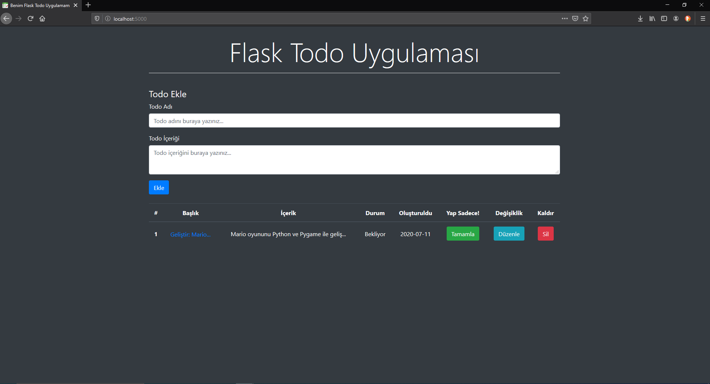
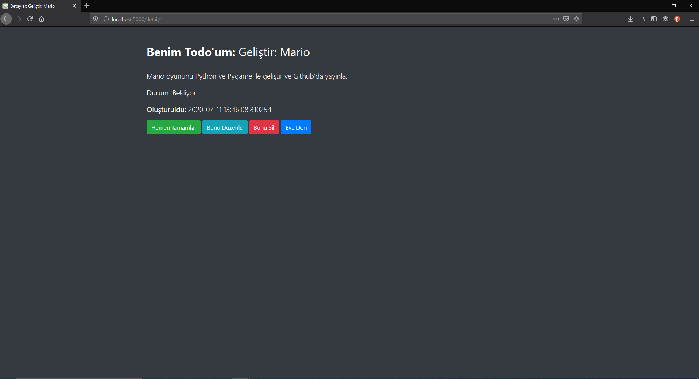

# Flask Todo Uygulaması

---

Python'ın **Flask** kütüphanesi sayesinde çok kolay bir şekilde web uygulamaları geliştirmek mümkün. Ve bu projede basit bir **todo** uygulaması yaptım.




### Todo Uygulamanın Özellikleri
* Yeni todo ekleme
* Todo silme
* Düzenleme
* Değiştirme
* Oluşturma tarihi ve bitirme tarihi
* Bootstrap4 ile zenginleştirilmiş arayüz

### Kullanım
`Windows kullanıcıları için...`
```bash
python app.py
```

`Linux veya MacOS kullanıcı python3 ile kullanmalı.`
```bash
python3 app.py
```

Daha sonra istediğiniz web tarayıcısını açın ve URL kısmına bunu yazın:
```bash
localhost:5000
```

Uygulama çalıştığı sürece yerelinizde (localhost) 5000 portunu kullanacaktır. Eğer bu portu değiştirmek isterseniz (ya da değiştirmeniz gerekiyorsa) `app.py` dosyasının en altında ki port numarasınız değiştiriniz.

`app.py`
```python
if __name__ == "__main__":
    app.run(debug=True, port=5000)
```
